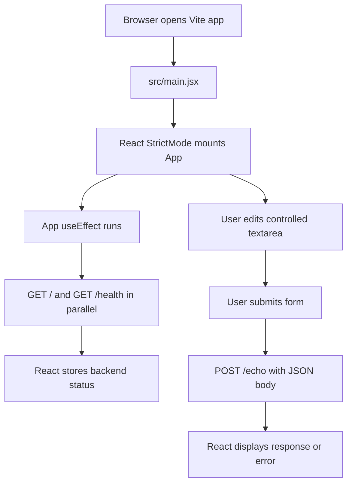

# React Frontend Flow

This app is a Vite-powered React frontend. It uses the shared FastAPI backend
running on `http://localhost:8000`.

## Frontend flow



1. Vite serves `index.html` and loads `src/main.jsx`.
2. `src/main.jsx` creates the React root, enables `StrictMode`, imports the
   global stylesheet, and renders `App`.
3. `src/App.jsx` owns the page UI, React state, and backend requests.
4. On mount, `useEffect` starts `GET /` and `GET /health` with `Promise.all`.
5. Successful responses update `rootMessage` and `healthStatus`.
6. The cleanup function aborts pending status requests if the component unmounts.
7. The textarea is controlled by the `payload` state.
8. Form submission prevents a page reload and sends the payload to `POST /echo`.
9. The returned JSON is stored in `echoResponse` and rendered as formatted JSON.

## Shared backend flow

The backend is defined in `../backend/main.py` and runs with FastAPI on port
`8000`.

| Method | Path | Purpose | Response |
| --- | --- | --- | --- |
| `GET` | `/` | Confirms the backend is running | `{ "message": "Demo backend is running" }` |
| `GET` | `/health` | Reports service health | `{ "status": "ok" }` |
| `POST` | `/echo` | Accepts a JSON object and returns it | `{ "data": <request body> }` |

FastAPI's CORS middleware allows requests from both frontend development
servers:

- `http://localhost:5173` and `http://127.0.0.1:5173` for Vite
- `http://localhost:3000` and `http://127.0.0.1:3000` for Next.js

## Error handling

- Failed startup requests show the error message and set health to
  `Unavailable`.
- An aborted startup request is ignored.
- Failed echo requests show the backend `detail`, HTTP status, or network error.

## Styling

- `src/index.css` defines global design tokens, fonts, page background, and
  browser defaults.
- `src/App.css` styles the dashboard, status panel, form, response, and mobile
  layout.

## Run locally

Start the backend:

```bash
cd ../backend
python main.py
```

Start this frontend:

```bash
cd React_Frontend
npm run dev
```

Open `http://localhost:5173`.

## Difference from my-app

This frontend is client-mounted by Vite through `src/main.jsx`. The entire
page is rendered by the browser after JavaScript loads. It does not use
Next.js routing, server components, or an App Router layout.
